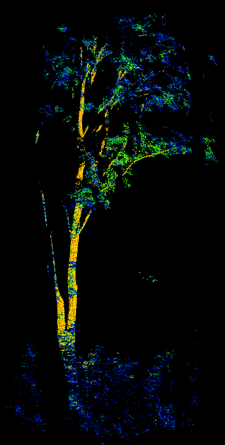
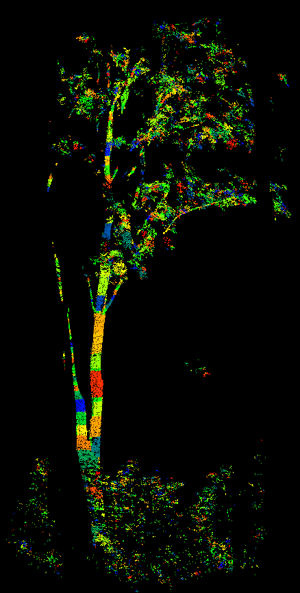

# cylsegment
Segment point clouds into cylinder shapes based on constrained region growing

The main code about cylinder segmentation in the paper:

Xi, Z.; Hopkinson, C.; Chasmer, L. Automating Plot-Level Stem Analysis from Terrestrial Laser Scanning. _Forests_ **2016**, _7_, 252.


Matlab and C++ versions are available now. New functions and python support will be added. CUDA version is also expected.

## **C++ Compile and build**

C++ code is under the cpp folder

Required library: **Armadillo, Eigen3, nanoflann**

**Eigen3** and **nanoflann** are header-only libraries. They are already included under __cpp/include__, no need to download additional files.

Header files of **Armadillo** are also included, but **Armadillo** also requires external library files. It is suggested to install Intel MKL (https://software.intel.com/en-us/mkl) and add libarary files (__mkl_core__, __mkl_intel_lp64__, __mkl_sequential__) to project.


Configure the CMakeLists.txt under __cpp/include__ to create project files. If CMake cannot detect MKL libraries automatically, tell CMake the file path of __mkl_core.lib__ (Windows) or __libmkl_core.a__(Linux).

Then compile and build the C++ project results from CMake. The final binary file is cylSegmenter(.exe)

## **C++ Run**

Input point cloud file must be ascii format. Sample data is __maple_tree_demo.txt__ under __data__. Type the following line in the command line console to see restuls. Third parameter 0.02 is 0.02m, an approximate of point resolution.

```
cylSegmenter.exe ../../../../data/maple_tree_demo.txt ../../../../result/maple_tree_demo_segs.txt 0.02
```

Snapshots




Contact: Zhouxin Xi, truebelief2010@gmail.com